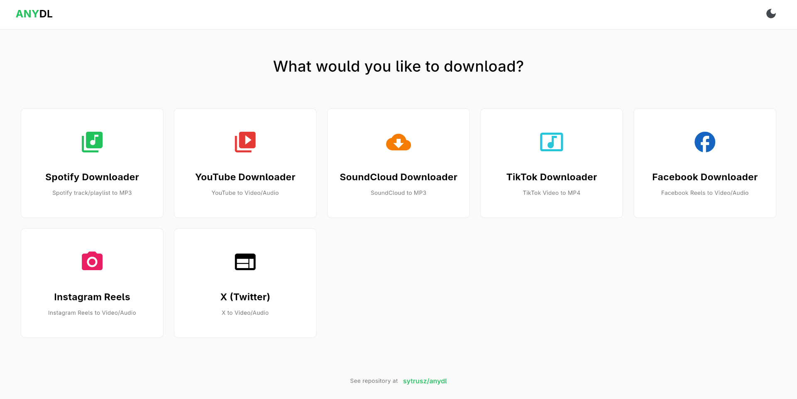

<div align="center">
  <h1>anydl</h1>
  <p>A unified, clean, and modern desktop application for downloading audio and video.</p>

  
</div>

## Overview

**anydl** is an open-source Python desktop application built with [Flet](https://flet.dev). It serves as a user-friendly graphical interface (GUI) that orchestrates several industry-standard command-line download engines.

---

## Powered By

This project is built upon the incredible work of the following repositories:

- [**yt-dlp**](https://github.com/yt-dlp/yt-dlp): The engine used for YouTube, TikTok, Facebook, X (Twitter), and Instagram downloads.
- [**spotDL**](https://github.com/spotDL/spotify-downloader): The engine used for Spotify track and playlist downloads.
- [**scdl**](https://github.com/flyingrub/scdl): The engine used for SoundCloud audio downloads.

---

## Features

- 🎥 **Video Downloads**: Download the "Best Video" (automatically merged to MP4) from YouTube, TikTok, Facebook, Instagram, and X.
- 🎵 **Music Downloads**: High-quality MP3 downloads from Spotify and SoundCloud with full metadata.
- 📊 **Real-Time Progress**: Watch your downloads complete with a live percentage progress bar.
- 📂 **Custom Save Locations**: Easily choose where your files go using your operating system's native folder picker.
- 🎨 **Modern UI**: A clean, distraction-free interface with Dark/Light mode support.

---

## Getting Started

### Prerequisites

Before using the app, you must have the following installed on your system:
1. **Python 3.8 or newer**: [Download Python here](https://www.python.org/downloads/).
2. **FFmpeg**: This is required by the underlying tools to convert video and audio formats.
   - **Windows**: Download from [gyan.dev](https://www.gyan.dev/ffmpeg/builds/) or install via winget: `winget install ffmpeg`
   - **macOS**: Install via Homebrew: `brew install ffmpeg`
   - **Linux**: Install via your package manager (e.g., `sudo apt install ffmpeg` or `sudo dnf install ffmpeg`)

### Installation & Running

1. **Clone or Download the Repository:**
   ```bash
   git clone https://github.com/sytrusz/anydl.git
   cd anydl
   ```

2. **Launch the Application:**
   Instead of a traditional executable, **anydl** runs locally as a fast, responsive web application directly in your browser. Our startup scripts handle all the setup (creating the virtual environment and installing dependencies) automatically!

   - **Windows:** Double-click the `start_windows.bat` file.
   - **Linux / macOS:** Run the `start_linux.sh` script in your terminal:
     ```bash
     ./start_linux.sh
     ```

   *The script will automatically set everything up and launch the app in your default web browser.*

---

## How to Use

1. **Select your tool:** Click one of the cards (Spotify, YouTube, TikTok, etc.) on the home screen.
2. **Choose a folder:** Click the folder icon at the bottom to set your download directory.
3. **Download:** Paste your URL and click **Download**.

---

## Credits & Acknowledgements

Massive thanks to the open-source community:
- [**Flet**](https://flet.dev/): The UI framework.
- [**yt-dlp**](https://github.com/yt-dlp/yt-dlp): The video engine.
- [**spotDL**](https://github.com/spotDL/spotify-downloader): The Spotify engine.
- [**scdl**](https://github.com/flyingrub/scdl): The SoundCloud engine.

## License
This project is open-source. Feel free to fork, modify, and distribute it!
